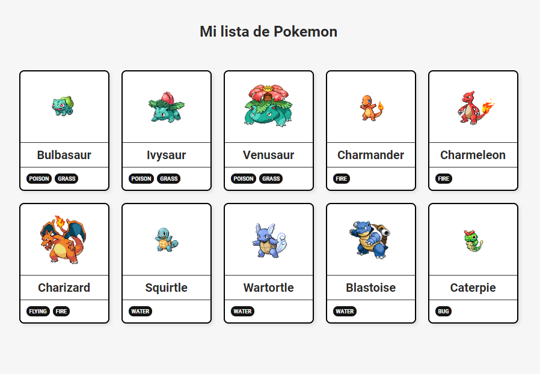

# Ejercicio de evaluación intermedia con React - Módulo 3 Adalab

## Gotta catch 'em all!

Este ejercicio forma parte de la evaluación intermedia del módulo 3 de Adalab. Consiste en desarrollar una página web sencilla con el framework **React**.

La web consiste en un listado de **pokemon**, con una tarjeta para cada uno con información relevante, como el nombre, tipos y una imagen. La información de los pokemon la obtenemos de un array de datos guardado en un fichero de tipo json que incluiremos en el estado del componente App.

Para desarrollar esta SPA he utilizado, entre otras, las siguientes tecnologías: **React, JavaScript **y** SASS.**

## Jerarquía de componentes

Para realizar el ejercicio y trabajar de manera más cómoda y productiva se han creado tres componentes:

1. **App**: componente raíz del proyecto. Se encarga de recoger los datos del archivo json y almacenarlos en su estado inicial, a la vez que los pasa a su hijo PokeList mediante props.
2. **PokeList**: componente hija de App. Recibe por props los datos de App y se encarga de pintar una lista `<ul></ul>` que contendrá ma través de un mapeo cada uno de los pokemons dentro de un elemento `<li></li>`.
3. **Pokemon**: componente nieto de App e hija de PokeList. Se encarga de pintar el contenido dentro de la tarjeta de cada Pokemon: cada una es un `<article></article>` con una imagen `` dentro que muestra el pokemon, un título `<h2></h2>` que pinta su nombre, y una lista `<ul></ul>` que mediante un mapeo pinta en un `<li></li>` sus tipos (fire, grass, etc.).

## Pasos realizados

- [x] Plantear en papel la estructura de componentes para la web.
- [x] Crear una nueva aplicación React.
- [x] Pintar una tarjeta, recogiendo la información de las props.
- [x] Pintar todas las tarjetas.
- [x] Crear dos componentes, PokeList y Pokemon respectivamente, para el listado y para la card de cada Pokemon.
- [x] BONUS: ajustar la maquetación al diseño y/o implementar mejoras visuales.

## Resultado final

## Nuevas funcionalidades

Próximamente implementaré las siguientes nuevas funcionalidades en la página: 

- [ ] Añadir un click a Pokemon que marca o desmarca el pokemon como favorito en el array del estado de App.
- [ ] Pasar este dato al componente Pokemon por props.
- [ ] Pintar Pokemon con otros estilos cuando por props nos llegue la info de que el pokemon es favorito.

---

Este proyecto ha sido desarrollado por **Leire Ordeñana Madina** como alumna de Adalab.

